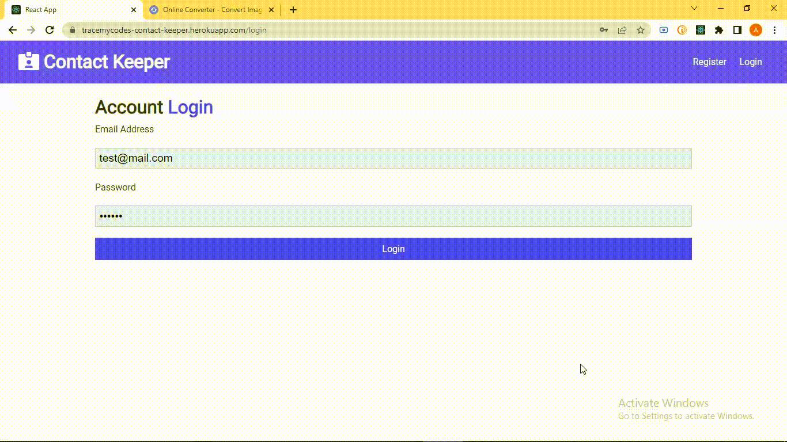
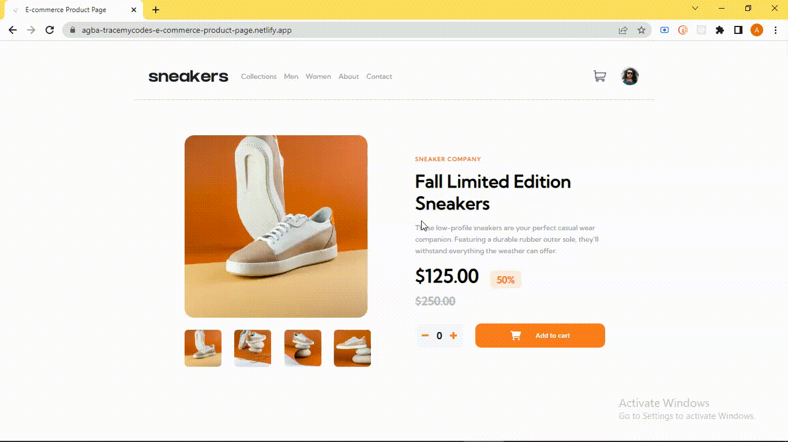

    
 

Hi there 👋 I’m a Fullstack developer, I design, build, implement user interface for websites, software programs, and web-based applications. I am currently open to any new clients or opportunities.

<!-- SOCIALS -->
<h1 align="center">Contact Me</h1>
  
   
    
    
       
    
  

<!-- 

 -->

 

## Git Stats &#x1f4c8;

 

  

 

## Projects &#127959;

<table bordercolor="#66b2b2">
  
  <tr>
    <td width="50%" valign="top">
      <h3 align="center">Contact Keeper</h3>
         
        
         
        

          
    
  
      

        
<strong>ReactJs, MongoDB, Node.js, & Express.js</strong> - A Full-stack web application that provides a Database that save's all of your professional and personal contact information, with CRUD functionality and responsive design.

    </td>
    <td width="50%" valign="top">
      <h3 align="center">E-commerce Product Page</h3>
         
      
         
        

          
  
  
      

        
<strong>Javascript, SCSS, OOP</strong> - A fully responsive E-commerce page built with the principles of Object Oriented Programming, Displaying multiple carousel elements, LightBox component, while actualizing user experience.

    </td>
  </tr>
  
  <tr>
    <td width="50%" valign="top">
      <h3 align="center">Countries API</h3>
       
        
       
        

  
  
      

        
<strong>ReactJs, Style-Components, Axios</strong> - An informative web application, displaying basic information about countries around the globe, useful whenever you're considering going on your next vacation trip. 	&#128515;

    </td>
    <td width="50%" valign="top">
      <h3 align="center">IP Address Tracker</h3>
         
        
         
        

          
  
  
      

        
<strong>HTML5, CSS3, Javascript, MapBox, & Leaflet</strong> - AI project, detecting the location details on an interactive map of any valid IP address using Geo-location

    </td>
  </tr>
</table>
