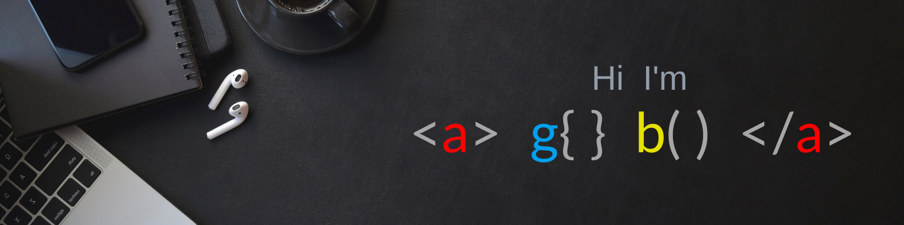

## Hi there 

I’m Agba (Trace_it), I design, build, and implement user interface for websites, software programs, and web-based applications.

 
 

- 🔭 I’m currently working on a collaborative project.
- 🌱 I’m currently learning Data Structures and Algorithms.
- 👯 I’m looking to collaborate Web Development Related Projects .
- 💬 Ask me about Anything, I am happy to help.
- 📫 How to reach me:
  - Personal: agbaemmanuel11@gmail.com
  - Work: tracemycodes@gmail.com
- 😄 Pronouns: He/They.
- ⚡ Fun fact: It’s all 0’s and 1’s.

 
 
## &#x1f4c8; GitHub Stats

 

<!--   -->

 
